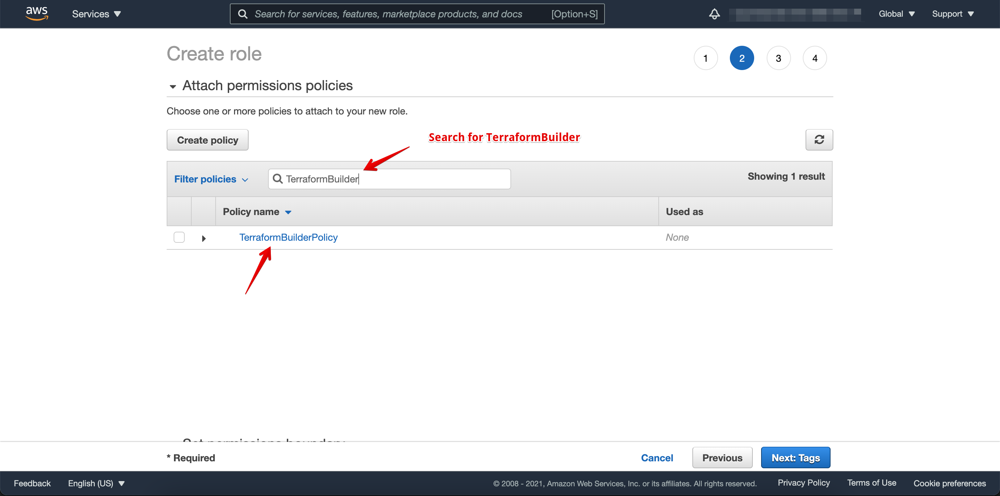

# Create a Secure IAM User and Role for Terraform on AWS
In order to build your infrastructure using Terraform IaaC you need to have valid credentials for selected cloud provider.

In the following sections we will create

- An IAM User known as `TerraformBuilder`
- and allow this user to `assume` as IAM Role known as `TerraformBuilderRole`


Before going through step by step material, use the build.sh file and generate the policy file for this tutorial.


```bash    
./build_policy.sh

ls -rtl 

# you should see the following files:
# TerraformBuilderInlinePolicy.json
# TerraformBuilderPolicy.json

```


## Creating IAM User
Access your `AWS Management console` and select IAM Service from AWS Managed Services

Select Users


Then select Add User


Select a name for your user, in my case: TerraformBuilder / Allow Pragmatic Access Only - Next


Next

 
Next


Check the user information for the last time and press create 


The Credentials will be created and ready to use for your terraform builder


Download the credentials file / or you can just copy and paste the  Access Key and Secret Key

The user created above can not perform any action. Now we need create a role and assign it to the user.


## IAM Policies
Every role needs to have a set of permission(s). Follow the instruction to create IAM Policy required to be attached to our Role.

Before starting make sure you are on AWS Management Console / IAM dashboard.

### Creating Terraform Builder Role Policy

From left hand-side of the dashboard, select `Policies` and then select 'Create policy'


Copy and Paste the content of `TerraformBuilderPolicy.json` into the Json tab as shown in the screenshot.


Next


Next

Name the policy `TerraformBuilderPolicy` and press create button.


## Creating IAM Role
Now we are going to Create a new role `TerraformBuilderRole` and assign the `TerraformBuilderPolicy` to it. This role will be 
assumed by Terraform user to create our infrastructure.


Next

Make sure you use your AWS Account ID as shown on the following screenshot: 

Next

And attach the 'TerraformBuilderPolicy' to the role as shown here:

Next


Next

Give a name to your role, in our case `TerraformBuilderRole`. This name matches the name defined in `TerraformBuilderInlinePolicy.json`
if you are going to use a different name, make sure you update that policy as well.

Next

And now the role is created.

### Allowing Terraform Builder role to assume the TerraformBuilderRole
Finally we need to allow Terraform Builder role to assume the role defined in the previous step, by selecting `Users` 
from left-hand side menu and following the instruction:

Search for IAM User `TerraformBuilder` and click on it 

Next

From `Permissions` tab select `Add inline policy`

Next

It will show `CreatePolicy` dialog and you need to copy and paste `TerraformBuilderInlinePolicy.json` into the `JSON` tab.

Next

Double check the Account number should be your Account number.

Next

And give a name to your Policy e.g. `TerraformBuilderInlinePolicy` and press create

Next

The created inline policy will be shown on your IAM user "Permissions" tab

Next

Now we are ready to use the IAM user for our Terraform client.

Please make a note of AWS Account Number, IAM User Credentials and Role name created above.


## Setting Up your Environment with IAM Credentials
Once you are done with above steps, you have two ways to configure the credntials and use them

### Storing Credentials as Environment variable
We can store and the IAM user credentials as follow and you can also read more about it [here](https://docs.aws.amazon.com/cli/latest/userguide/cli-configure-envvars.html)

```bash

# in your terminal (mac or linux)

export AWS_ACCESS_KEY_ID=YOUR KEY
export AWS_SECRET_ACCESS_KEY=YOUR SECRET KEY
export AWS_DEFAULT_REGION=YOUR REGION

# on Windows you can use the "Set" command to do that. Read AWS doc for that.

```

- Setting the environment variable changes the value used until the end of your shell session, or until you set the variable to a different value. 
You can make the variables persistent across future sessions by setting them in your shell's startup script.

- For AWS region `AWS_DEFAULT_REGION`, please select the closest region to yourself, you can find list of all AWS regions here:


### Storing and using Credentials using AWS CLI v2 (Recommended)
You can use AWS CLI v2 to configure you IAM credentials. Please see the References section for how to install and configure it.

```bash
# on Linux and Mac

# You will be prompted for Key, Secret, Region and output format (e.g. json or yaml)
aws configure 

```

## Check your credentials
Before checking your credentials, make sure you have AWS CLI installed on your machine. If you don't know, please follow 
the AWS instruction link provided in the references section.

### Check if IAM user can Assume the role.
To do this we are going to use AWS STS(Secure Token Service) from the command line.

```bashe
export AWS_ACCOUNT=PUT YOUR AWS ACCOUNT NUMBER HERE
export ROLE_ARN=arn:aws:iam::$AWS_ACCOUNT\:role/TerraformBuilderRole
aws sts assume-role --role-session-name checkiam --role-arn $ROLE_ARN --profile default

# if you see an error like below then something is incorrect check your policies and credentials.

An error occurred (AccessDenied) when calling the AssumeRole operation: User: arn:aws:iam::xxxxxxxxxx:user/TerraformBuilder is not 
authorized to perform: sts:AssumeRole on resource: arn:aws:iam::xxxxxxxxxxxx/role/TerraformBuilderRole
```

### Check if we can access other AWS resources including S3 or EC2
before doing that, we need to get a STS token first and export its data as environment variable.
```bash

unset AWS_ACCESS_KEY_ID AWS_SECRET_ACCESS_KEY AWS_SESSION_TOKEN

export AWS_ACCOUNT=PUT YOUR AWS ACCOUNT NUMBER HERE
export ROLE_ARN=arn:aws:iam::$AWS_ACCOUNT\:role/TerraformBuilderRole

creds_json=$(aws sts assume-role --role-session-name checkiam --role-arn $ROLE_ARN --profile default)
export AWS_ACCESS_KEY_ID=$(echo "$creds_json" | jq .Credentials.AccessKeyId)
export AWS_SECRET_ACCESS_KEY=$(echo "$creds_json" | jq .Credentials.SecretAccessKey)
export AWS_SESSION_TOKEN=$(echo "$creds_json" | jq .Credentials.SessionToken)


```
Now we are ready to run a command:

```bash
# Lets run s3 Command

aws s3 ls  

aws ec2 describe-instances --region ap-southeast-2

```

## Consideration
Its possible to limit the role to lesser permission but removing `s3:*` and `ec2:*` to more specific requirements. Avoid using
* permission as much as possible.


## References
[What Is the AWS CLI?](https://docs.aws.amazon.com/cli/latest/userguide/cli-chap-welcome.html)
[Installing, updating, and uninstalling the AWS CLI version 2](https://docs.aws.amazon.com/cli/latest/userguide/install-cliv2.html)


